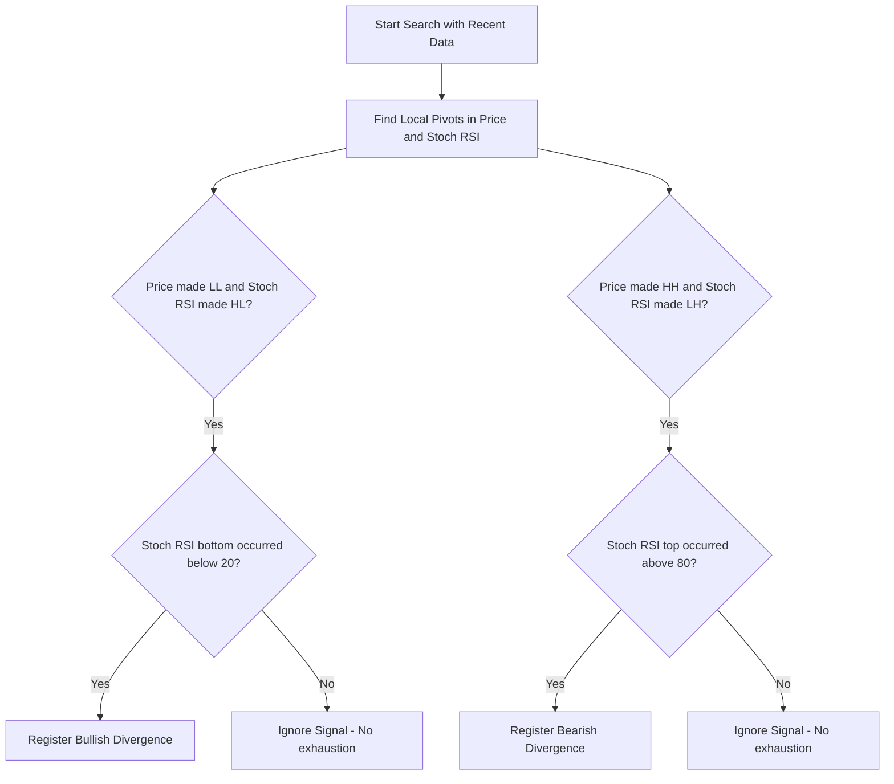

# Feature 3: Divergence Detector on Stochastic RSI

This feature describes the algorithm responsible for mapping and alerting bullish and bearish divergences between price action and the Stochastic RSI indicator.

---

## 1. What are Divergences?

Divergences occur when the direction of price peaks/troughs differs from the direction of peaks/troughs of the Stochastic RSI indicator. They are powerful signals of trend reversal, especially on High Time Frames (HTF).

* **Regular Bullish Divergence**:
  * **Price**: Makes a Lower Low (LL).
  * **Stoch RSI**: Makes a Higher Low (HL).
  * *Interpretation*: The price is falling, but the selling pressure (momentum) is exhausting. High probability of upward reversal.
* **Regular Bearish Divergence**:
  * **Price**: Makes a Higher High (HH).
  * **Stoch RSI**: Makes a Lower High (LH).
  * *Interpretation*: The price is rising, but the buying pressure (momentum) is losing strength. High probability of downward reversal.

---

## 2. The Detection Algorithm Step-by-Step

The scanner executes the following mathematical steps on a time series of size $M$ (e.g. last 100 candles):



### Step 1: Pivot Definition (Local Tops and Bottoms)
A low pivot (local bottom) occurs at candle $i$ if its low is less than the lows of the neighboring candles to the left and right:
$$\text{Low}_{i} < \min(\text{Low}_{i-1}, \text{Low}_{i-2}, \text{Low}_{i+1}, \text{Low}_{i+2})$$
*(This is a pivot of strength 2, meaning 2 candles on each side).*

### Step 2: Comparison of Two Successive Pivots
We identify the two most recent pivots in the price: $P_1$ (previous pivot) at index $t_1$, and $P_2$ (most recent pivot) at index $t_2$, where $t_2 > t_1$.

* **For Bullish Divergence**:
  1. $P_2$ is lower than $P_1$ in Price: $\text{Low}(t_2) < \text{Low}(t_1)$.
  2. Identify the corresponding Stoch RSI (%K) values in the same period: $I_1 = \text{StochRSI}(t_1)$ and $I_2 = \text{StochRSI}(t_2)$.
  3. Verify if the indicator went up: $I_2 > I_1$.
  4. Ensure exhaustion: $I_2 \le 20$ or $I_1 \le 20$.

* **For Bearish Divergence**:
  1. $P_2$ is higher than $P_1$ in Price: $\text{High}(t_2) > \text{High}(t_1)$.
  2. Identify the corresponding Stoch RSI (%K) values in the same period: $I_1 = \text{StochRSI}(t_1)$ and $I_2 = \text{StochRSI}(t_2)$.
  3. Verify if the indicator fell: $I_2 < I_1$.
  4. Ensure exhaustion: $I_2 \ge 80$ or $I_1 \ge 80$.

---

## 3. Example Code (TypeScript)

```typescript
interface Pivot {
  index: number;
  price: number;
  indicatorValue: number;
  type: 'high' | 'low';
}

export function findDivergences(prices: number[], indicator: number[], windowSize = 30): 'BULLISH' | 'BEARISH' | 'NONE' {
  const pivots: Pivot[] = [];
  const strength = 2; // Candles for confirmation

  // 1. Find Pivots
  for (let i = strength; i < prices.length - strength; i++) {
    // Low Pivot
    if (prices[i] < Math.min(...prices.slice(i - strength, i)) && 
        prices[i] < Math.min(...prices.slice(i + 1, i + strength + 1))) {
      pivots.push({ index: i, price: prices[i], indicatorValue: indicator[i], type: 'low' });
    }
    // High Pivot
    if (prices[i] > Math.max(...prices.slice(i - strength, i)) && 
        prices[i] > Math.max(...prices.slice(i + 1, i + strength + 1))) {
      pivots.push({ index: i, price: prices[i], indicatorValue: indicator[i], type: 'high' });
    }
  }

  // Get the last two pivots of each type
  const lowPivots = pivots.filter(p => p.type === 'low').slice(-2);
  const highPivots = pivots.filter(p => p.type === 'high').slice(-2);

  // 2. Check Bullish Divergence
  if (lowPivots.length === 2) {
    const [p1, p2] = lowPivots;
    // The most recent pivot must be within the analyzed window
    if (prices.length - p2.index <= windowSize) {
      if (p2.price < p1.price && p2.indicatorValue > p1.indicatorValue && (p2.indicatorValue <= 25 || p1.indicatorValue <= 25)) {
        return 'BULLISH';
      }
    }
  }

  // 3. Check Bearish Divergence
  if (highPivots.length === 2) {
    const [p1, p2] = highPivots;
    if (prices.length - p2.index <= windowSize) {
      if (p2.price > p1.price && p2.indicatorValue < p1.indicatorValue && (p2.indicatorValue >= 75 || p1.indicatorValue >= 75)) {
        return 'BEARISH';
      }
    }
  }

  return 'NONE';
}
```

---

## 4. Alerts UI/UX
* **Chart Visualization**: Plot a violet dashed line connecting the two bottoms/tops on the price chart and the oscillator, with an arrow pointing the direction of the divergence.
* **Status Badge**: On the top right of the dashboard, display a flashing neon green badge like `Bullish Divergence (1w)` or red `Bearish Divergence (3d)`.
