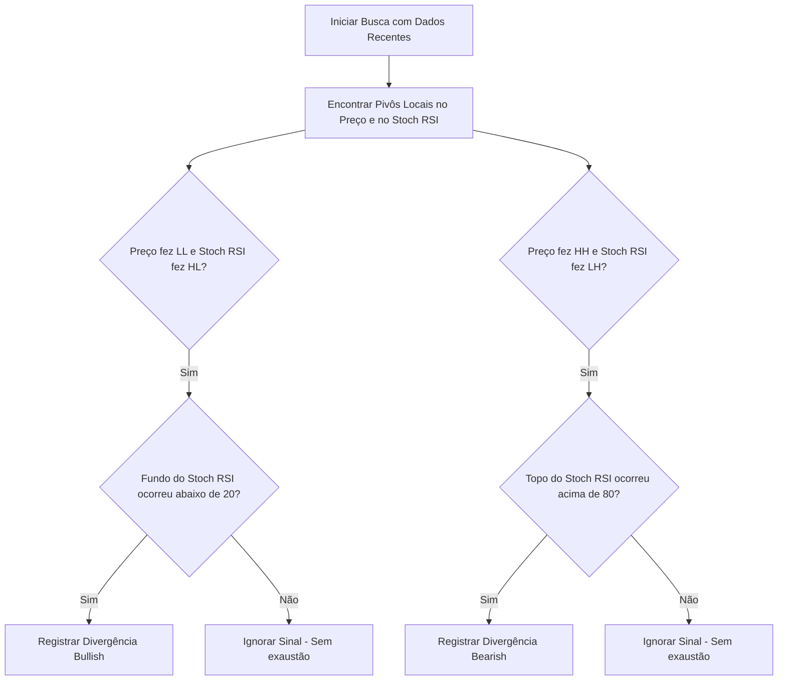

# Funcionalidade 3: Detector de Divergências no Stochastic RSI

Esta funcionalidade descreve o algoritmo responsável por mapear e alertar divergências de alta (Bullish) e de baixa (Bearish) entre a ação do preço e o indicador Stochastic RSI.

---

## 1. O que são Divergências?

As divergências ocorrem quando a direção dos topos ou fundos do preço difere da direção dos topos ou fundos do indicador Stochastic RSI. Elas são sinais poderosos de reversão de tendência, especialmente em tempos gráficos elevados (HTF).

* **Divergência Regular de Alta (Bullish)**:
  * **Preço**: Faz um Fundo Mais Baixo (Lower Low - LL).
  * **Stoch RSI**: Faz um Fundo Mais Alto (Higher Low - HL).
  * *Interpretação*: O preço está caindo, mas a pressão vendedora (momentum) está se esgotando. Alta probabilidade de reversão para cima.
* **Divergência Regular de Baixa (Bearish)**:
  * **Preço**: Faz um Topo Mais Alto (Higher High - HH).
  * **Stoch RSI**: Faz um Topo Mais Baixo (Lower High - LH).
  * *Interpretação*: O preço está subindo, mas a pressão compradora (momentum) está perdendo força. Alta probabilidade de reversão para baixo.

---

## 2. O Algoritmo de Detecção Passo a Passo

O scanner executa as seguintes etapas matemáticas em uma série temporal de tamanho $M$ (ex: últimas 100 velas):



### Passo 1: Definição de Pivôs (Topos e Fundos Locais)
Um pivô de baixa (fundo local) ocorre na vela $i$ se a sua mínima for menor que as mínimas das velas vizinhas à esquerda e à direita:
$$\text{Low}_{i} < \min(\text{Low}_{i-1}, \text{Low}_{i-2}, \text{Low}_{i+1}, \text{Low}_{i+2})$$
*(Isso é um pivô com força 2, ou seja, 2 velas de cada lado).*

### Passo 2: Comparação de Dois Pivôs Sucessivos
Identificamos os dois pivôs mais recentes no preço: $P_1$ (pivô anterior) no índice $t_1$, e $P_2$ (pivô mais recente) no índice $t_2$, onde $t_2 > t_1$.

* Para **Divergência Bullish**:
  1. $P_2$ é menor que $P_1$ no Preço: $\text{Low}(t_2) < \text{Low}(t_1)$.
  2. Identificar os valores correspondentes de Stoch RSI (%K) no mesmo período: $I_1 = \text{StochRSI}(t_1)$ e $I_2 = \text{StochRSI}(t_2)$.
  3. Verificar se o indicador subiu: $I_2 > I_1$.
  4. Garantir exaustão: $I_2 \le 20$ ou $I_1 \le 20$.

* Para **Divergência Bearish**:
  1. $P_2$ é maior que $P_1$ no Preço: $\text{High}(t_2) > \text{High}(t_1)$.
  2. Identificar os valores correspondentes de Stoch RSI (%K) no mesmo período: $I_1 = \text{StochRSI}(t_1)$ e $I_2 = \text{StochRSI}(t_2)$.
  3. Verificar se o indicador caiu: $I_2 < I_1$.
  4. Garantir exaustão: $I_2 \ge 80$ ou $I_1 \ge 80$.

---

## 3. Código Exemplo (TypeScript)

```typescript
interface Pivot {
  index: number;
  price: number;
  indicatorValue: number;
  type: 'high' | 'low';
}

export function findDivergences(prices: number[], indicator: number[], windowSize = 30): 'BULLISH' | 'BEARISH' | 'NONE' {
  const pivots: Pivot[] = [];
  const strength = 2; // Velas para confirmação

  // 1. Encontrar Pivôs
  for (let i = strength; i < prices.length - strength; i++) {
    // Pivô de Fundo (Low)
    if (prices[i] < Math.min(...prices.slice(i - strength, i)) && 
        prices[i] < Math.min(...prices.slice(i + 1, i + strength + 1))) {
      pivots.push({ index: i, price: prices[i], indicatorValue: indicator[i], type: 'low' });
    }
    // Pivô de Topo (High)
    if (prices[i] > Math.max(...prices.slice(i - strength, i)) && 
        prices[i] > Math.max(...prices.slice(i + 1, i + strength + 1))) {
      pivots.push({ index: i, price: prices[i], indicatorValue: indicator[i], type: 'high' });
    }
  }

  // Pegar os dois últimos pivôs de cada tipo
  const lowPivots = pivots.filter(p => p.type === 'low').slice(-2);
  const highPivots = pivots.filter(p => p.type === 'high').slice(-2);

  // 2. Verificar Divergência Bullish
  if (lowPivots.length === 2) {
    const [p1, p2] = lowPivots;
    // O pivô mais recente deve estar dentro da janela analisada
    if (prices.length - p2.index <= windowSize) {
      if (p2.price < p1.price && p2.indicatorValue > p1.indicatorValue && (p2.indicatorValue <= 25 || p1.indicatorValue <= 25)) {
        return 'BULLISH';
      }
    }
  }

  // 3. Verificar Divergência Bearish
  if (highPivots.length === 2) {
    const [p1, p2] = highPivots;
    if (prices.length - p2.index <= windowSize) {
      if (p2.price > p1.price && p2.indicatorValue < p1.indicatorValue && (p2.indicatorValue >= 75 || p1.indicatorValue >= 75)) {
        return 'BEARISH';
      }
    }
  }

  return 'NONE';
}
```

---

## 4. UI/UX dos Alertas
* **Visualização no Gráfico**: Plotar uma linha tracejada violeta ligando os dois fundos/topos no gráfico de preços e no oscilador, com uma seta apontando a direção da divergência.
* **Badge de Status**: Na parte superior direita do dashboard, exibir um badge piscante em neon verde `Divergência Bullish (1w)` ou vermelho `Divergência Bearish (3d)`.
