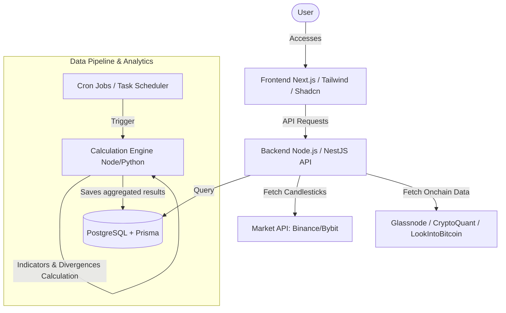

# SaaS Financial Indicator - Project Plan & Architecture

This document presents the technical and product specification for the development of a modern crypto asset analysis SaaS platform (BTC/USD, ETH/USD, SOL/USD) focused on medium/long-term timeframes (High Time Frames - HTF) and on-chain data confluence.

---

## 1. Product Overview (PRD)

### 1.1. The Problem
Medium and long-term investors face excessive noise on low timeframes (1h, 4h, daily). There is a lack of SaaS tools that merge classic technical analysis on highly relevant timeframes (3 days, 1 week, 2 weeks, monthly) with on-chain fair value metrics (MVRV, Realized Prices, Rainbow Chart) and automatic detection of complex patterns (Fair Value Gaps and Stochastic RSI Divergences).

### 1.2. The Solution
A premium analytical SaaS dashboard, with a modern design, providing:
1. **Advanced Charts (High Time Frame)**: BTC/USD, ETH/USD, and SOL/USD on 3d, 1w, 2w, and 1M periodicities.
2. **Automated Technical Indicators**:
   - Moving Averages: 9, 21, 52, 100, and 200 periods.
   - RSI (Relative Strength Index).
   - Stochastic RSI.
   - Algorithmic detection of **Bullish/Bearish Divergences on Stochastic RSI**.
3. **Price Action & Structure**:
   - Automatic mapping of **FVG (Fair Value Gaps)**.
   - Dynamic and static **Support & Resistance** (S/R) zones.
   - Automatic definition of **Macro Trend**.
4. **Confluent On-Chain Metrics**:
   - Integration of the **Rainbow Chart**.
   - **MVRV Z-Score** (Market Value to Realized Value).
   - Short-Term Holder Realized Price (**STH-RP**).
   - Long-Term Holder Realized Price (**LTH-RP**).
5. **Prediction Panel (Next 2 Months)**: A weighted confluence algorithm to forecast market direction over the next 60 days with statistical probability.

---

## 2. System Architecture

The application will be divided into decoupled services/microservices to ensure scalability, since fetching on-chain data and calculating indicators across multiple timeframes can be computationally expensive.

### 2.1. Proposed Technologies
* **Frontend**: Next.js (React) with TypeScript, TailwindCSS for premium HSL-based styling, Shadcn UI for interface components, Lucide Icons, Framer Motion for smooth micro-animations and transitions.
* **Charting Library**: **TradingView Lightweight Charts** or **TradingView Advanced Charts** via widget/iframe.
* **Backend**: Node.js with NestJS (TypeScript) or Fastify.
* **Database**: PostgreSQL with Prisma ORM.
* **Cache**: Redis to store candle data and on-chain metrics.
* **Data Sources**:
  - *Historical Prices*: Binance API or CoinGecko API.
  - *On-Chain Data*: Glassnode API, CryptoQuant API, LookIntoBitcoin, or CoinMetrics.

---

## 3. Feature Specifications

For detailed step-by-step specifications of each feature, refer to the following documents in the `docs/` folder:

1. **[TradingView & HTF Analysis](docs/1_graficos_e_timeframes.md)**: Configuration of 3d, 1w, 2w, 1M timeframes and chart integration.
2. **[Moving Averages and Technical Indicators](docs/2_medias_moveis_e_indicadores.md)**: Calculation rules for the 9, 21, 52, 100, 200 averages, RSI, and Stochastic RSI.
3. **[Stoch RSI Divergence Detector](docs/3_deteccao_divergencias.md)**: Step-by-step algorithm for Bullish/Bearish divergence mapping.
4. **[FVG and Support/Resistance](docs/4_fvg_suporte_resistencia.md)**: Logic for plotting and identifying Fair Value Gaps and S/R zones.
5. **[Confluent On-Chain Data](docs/5_confluencia_onchain.md)**: Data modeling for the Rainbow Chart, MVRV Z-Score, STH-RP, and LTH-RP.
6. **[Prediction Strategy (2 Months)](docs/6_estrategia_predicao.md)**: Weighted prediction engine and decision-making intelligence.
