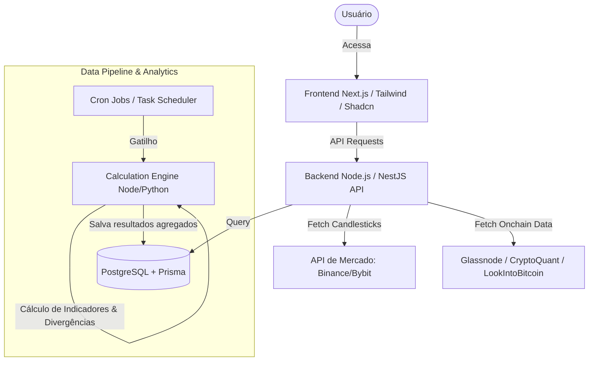

# SaaS Financial Indicator - Plano de Projeto e Arquitetura

Este documento apresenta a especificação técnica e de produto para o desenvolvimento de uma plataforma SaaS moderna de análise de criptoativos (BTC/USD, ETH/USD, SOL/USD) focada em tempos gráficos de médio/longo prazo (High Time Frames - HTF) e confluência de dados on-chain.

---

## 1. Visão Geral do Produto (PRD)

### 1.1. O Problema
Investidores de médio e longo prazo enfrentam ruído excessivo em tempos gráficos curtos (1h, 4h, diário). Faltam ferramentas SaaS que unam a análise técnica clássica em tempos gráficos de alta relevância (3 dias, 1 semana, 2 semanas, mensal) com métricas de valor justo on-chain (MVRV, Realized Prices, Rainbow Chart) e detecção automática de padrões complexos (Fair Value Gaps e Divergências no Stochastic RSI).

### 1.2. A Solução
Um painel analítico (Dashboard) SaaS premium, com design moderno, que fornece:
1. **Gráficos Avançados (High Time Frame)**: BTC/USD, ETH/USD e SOL/USD nas periodicidades de 3d, 1w, 2w e 1M.
2. **Indicadores Técnicos Automáticos**:
   - Médias Móveis: 9, 21, 52, 100 e 200 períodos.
   - RSI (Relative Strength Index).
   - Stochastic RSI.
   - Algoritmo de detecção de **Divergências Bullish/Bearish no Stochastic RSI**.
3. **Price Action & Estrutura**:
   - Mapeamento automático de **FVG (Fair Value Gaps)**.
   - Zonas de **Suporte e Resistência** (S/R) dinâmicas e estáticas.
   - Definição automática de **Tendência macro**.
4. **Métricas On-chain Confluentes**:
   - Integração do **Rainbow Chart**.
   - **MVRV Z-Score** (Market Value to Realized Value).
   - Preço Realizado de Curto Prazo (**Short-Term Holder Realized Price - STH-RP**).
   - Preço Realizado de Longo Prazo (**Long-Term Holder Realized Price - LTH-RP**).
5. **Painel de Predição (Próximos 2 Meses)**: Um algoritmo de confluência ponderada para prever a direção do mercado nos próximos 60 dias com probabilidade estatística.

---

## 2. Arquitetura do Sistema

A aplicação será dividida em uma arquitetura de microsserviços/serviços desacoplados para garantir escalabilidade, visto que a coleta de dados on-chain e o cálculo de indicadores em múltiplos timeframes podem ser pesados.

### 2.1. Tecnologias Propostas
* **Frontend**: Next.js (React) com TypeScript, TailwindCSS para estilização premium baseada em HSL, Shadcn UI para componentes de interface, Lucide Icons, Framer Motion para micro-animações e transições fluidas.
* **Biblioteca Gráfica**: **TradingView Lightweight Charts** ou **TradingView Advanced Charts** via widget/iframe.
* **Backend**: Node.js com NestJS (TypeScript) ou Fastify.
* **Database**: PostgreSQL com Prisma ORM.
* **Cache**: Redis para armazenar dados de velas e métricas on-chain.
* **Data Sources (Fontes de Dados)**:
  - *Preços Históricos*: Binance API ou CoinGecko API.
  - *On-Chain Data*: Glassnode API, CryptoQuant API, LookIntoBitcoin ou CoinMetrics.

---

## 3. Especificação das Funcionalidades

Para detalhamento passo a passo de cada uma das funcionalidades, consulte os seguintes documentos na pasta `docs/`:

1. **[TradingView & HTF Analysis](file:///home/coderbr/coderbr-lab/saas-financial-indicator/docs/1_graficos_e_timeframes.md)**: Configuração dos timeframes de 3d, 1w, 2w, 1M e integração dos gráficos.
2. **[Médias Móveis e Indicadores Técnicos](file:///home/coderbr/coderbr-lab/saas-financial-indicator/docs/2_medias_moveis_e_indicadores.md)**: Regras de cálculo para as médias de 9, 21, 52, 100, 200, RSI e Stochastic RSI.
3. **[Detector de Divergências no Stoch RSI](file:///home/coderbr/coderbr-lab/saas-financial-indicator/docs/3_deteccao_divergencias.md)**: Algoritmo passo a passo para mapeamento de divergências Bullish/Bearish.
4. **[FVG e Suportes/Resistências](file:///home/coderbr/coderbr-lab/saas-financial-indicator/docs/4_fvg_suporte_resistencia.md)**: Lógica para plotagem e identificação de Fair Value Gaps e zonas S/R.
5. **[Dados On-Chain Confluentes](file:///home/coderbr/coderbr-lab/saas-financial-indicator/docs/5_confluencia_onchain.md)**: Modelagem de dados para o Rainbow Chart, MVRV Z-Score, STH-RP e LTH-RP.
6. **[Estratégia de Predição (2 Meses)](file:///home/coderbr/coderbr-lab/saas-financial-indicator/docs/6_estrategia_predicao.md)**: Motor de predição ponderada e inteligência de tomada de decisão.
